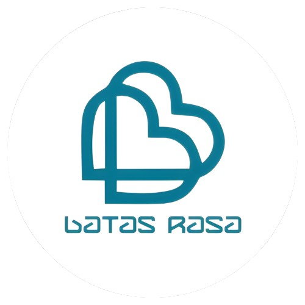

# Landing page Batas Rasa Outdoor

## Deskripsi

Proyek ini merupakan submission untuk kelas "Belajar Dasar Pemrograman Web" di Dicoding Indonesia. Tujuan proyek ini adalah untuk membuat landing page yang semantik, responsif dan terstruktur dengan baik untuk platform penyewaan alat outdoor.

Dalam proyek ini, saya telah menerapkan:

- HTML Semantik: Menggunakan elemen-elemen HTML yang tepat untuk meningkatkan aksesibilitas dan SEO.
- Desain Responsif: Menggunakan media queries dan desain fleksibel untuk memastikan tampilan yang optimal di berbagai perangkat.
- CSS Grid dan Flexbox: Menggunakan teknik CSS modern untuk tata letak yang kompleks dan responsif.
- Penggunaan Font Kustom: Menggunakan Google Fonts untuk meningkatkan estetika teks.
- Ikon Font: Menggunakan Font Awesome untuk menambahkan ikon yang informatif dan menarik.
- Interaktivitas dengan JavaScript: Menambahkan fungsionalitas interaktif seperti pada navbar, tombol pencarian, keranjang belanja, dan navigasi hamburger.
- Aksesibilitas: Menggunakan atribut aria-label dan praktik terbaik lainnya untuk membuat situs web lebih dapat diakses oleh semua pengguna.

## Teknologi yang Digunakan

- **HTML5**: Untuk struktur semantik konten.
- **CSS3**: Untuk tata letak dan desain halaman.
- **JavaScript**: Untuk fitur interaktif.

## Kontak

Untuk pertanyaan, silakan hubungi [adiseptiandi06@student.unsia.co.id](mailto:adiseptiandi06@student.unsia.co.id).
